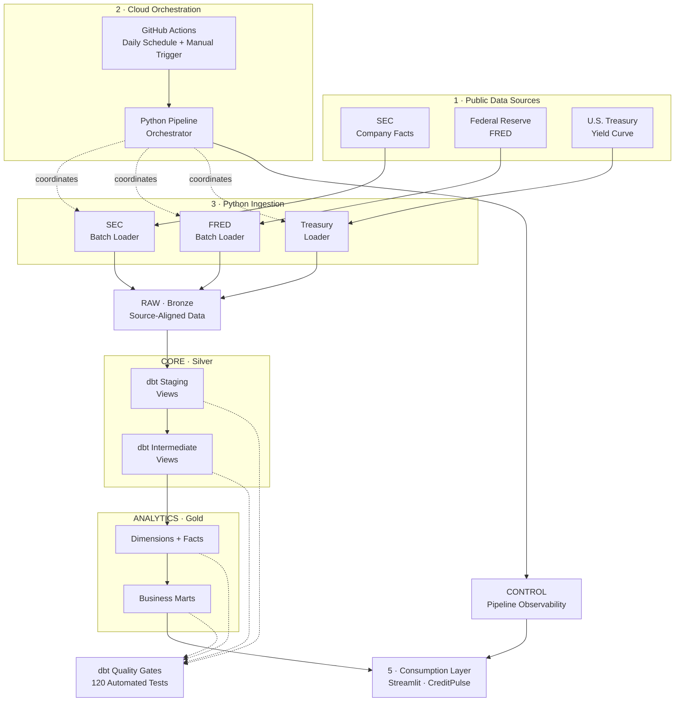
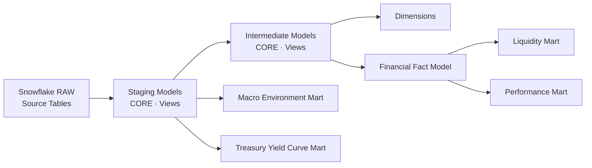
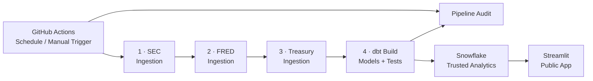

<div align="center">

# CreditPulse

### Corporate Credit & Liquidity Risk Intelligence Platform

**An automated data platform that transforms public financial, macroeconomic, and interest-rate data into governed corporate credit and liquidity analytics.**

[](https://creditpulse-risk-intelligence.streamlit.app/)
[](https://www.python.org/)
[](https://www.snowflake.com/)
[](https://www.getdbt.com/)
[](https://github.com/features/actions)
[](#data-quality--testing)
[](#production-validation)

### [Launch CreditPulse →](https://creditpulse-risk-intelligence.streamlit.app/)

**[Architecture](#architecture)** ·
**[dbt Engineering](#dbt-analytics-engineering)** ·
**[Data Quality](#data-quality--testing)** ·
**[Automation](#automation--orchestration)** ·
**[Engineering Decisions](#engineering-decisions--trade-offs)** ·
**[Roadmap](#roadmap)**

</div>

---

## Executive Overview

CreditPulse is an end-to-end corporate credit and liquidity analytics platform built around a practical data engineering problem:

> **How can heterogeneous public financial data be transformed into a reliable, governed, continuously refreshed analytical product?**

The platform ingests company financial facts from the **SEC**, macroeconomic indicators from the **Federal Reserve Economic Data (FRED)** platform, and interest-rate data from the **U.S. Treasury**.

Python ingestion services load source-aligned records into Snowflake. **dbt acts as the semantic and quality boundary** between raw source data and trusted analytical products. GitHub Actions orchestrates cloud execution, Snowflake persists operational metadata, and a publicly deployed Streamlit application serves the resulting analytics.

CreditPulse is intentionally designed as a **data platform rather than a dashboard-only project**.

The dashboard is simply the final consumption layer of a system that includes:

- source ingestion and API integration
- governed company configuration
- Snowflake medallion-style architecture
- financial metric normalization
- reporting-period semantics
- revision and duplicate handling
- dimensional and analytical modeling
- automated dbt quality gates
- cloud orchestration
- persistent pipeline observability
- least-privilege application access
- public application deployment

### Current V1 scope

CreditPulse focuses on a governed universe of U.S. public non-financial companies and provides analytical visibility into:

- short-term liquidity
- cash availability
- operating cash generation
- revenue and asset trends
- macroeconomic conditions
- Federal Funds conditions
- inflation and unemployment
- Treasury rates
- yield-curve structure
- pipeline health and data freshness

The initial governed universe contains:

`AAPL` · `MSFT` · `WMT` · `F` · `CAT`

Company coverage is configuration-driven, allowing the analytical universe to expand without redesigning the ingestion framework, transformation architecture, or dashboard.

> **CreditPulse provides analytical signals and context. It does not produce official credit ratings, investment recommendations, or default probabilities.**

---

# Live Application

### [creditpulse-risk-intelligence.streamlit.app](https://creditpulse-risk-intelligence.streamlit.app/)

The deployed application queries trusted Snowflake analytical marts using an isolated read-only service identity.

The dashboard exposes six primary analytical perspectives:

| Area | Business Question |
|---|---|
| **Financial Signals** | What do the latest liquidity and cash-generation metrics indicate? |
| **Liquidity** | Is short-term financial flexibility strengthening or deteriorating? |
| **Cash Position** | How is cash evolving relative to the company's asset base? |
| **Financial Performance** | How are revenue, operating cash flow, margins, and growth changing? |
| **Macro & Rates** | What economic and interest-rate environment surrounds the company? |
| **Platform Health** | Did the latest pipeline succeed and how fresh is the analytical data? |

The application is backed by Snowflake rather than static extracts. New source data loaded by the production pipeline flows through dbt and becomes available to the application without requiring a dashboard redeployment.

---

# Engineering at a Glance

| Capability | Implementation |
|---|---|
| **Financial Data** | SEC Company Facts |
| **Macroeconomic Data** | FRED |
| **Interest-Rate Data** | U.S. Treasury Daily Treasury Par Yield Curve |
| **Ingestion** | Python |
| **Cloud Data Platform** | Snowflake |
| **Architecture** | RAW → CORE → ANALYTICS |
| **Transformation** | dbt Core |
| **dbt Structure** | Staging → Intermediate → Dimensions / Facts / Marts |
| **dbt Models** | 16 |
| **Automated dbt Tests** | 120 |
| **Governed dbt Seeds** | 2 |
| **Source Systems** | 3 |
| **Orchestration** | Python + GitHub Actions |
| **Schedule** | Daily cloud execution + manual trigger |
| **Observability** | `CONTROL.PIPELINE_RUNS` |
| **Visualization** | Streamlit + Plotly |
| **Dependency Management** | `uv` + `uv.lock` |
| **Authentication** | Snowflake key-pair authentication for public application |
| **Authorization** | Dedicated read-only RBAC |
| **Deployment** | GitHub + Streamlit Community Cloud |

---

# Business Problem

Corporate financial analysis rarely begins with clean and comparable data.

Public financial and economic sources introduce several engineering challenges.

### Financial reporting semantics

SEC financial data mixes fundamentally different types of observations.

Balance-sheet metrics such as cash and current assets represent **points in time**, while revenue and operating cash flow represent **activity over a reporting period**.

Quarterly, year-to-date, annual, and instantaneous values cannot safely be mixed simply because they share the same company and fiscal year.

### Metric inconsistency

Companies may use different XBRL concepts to represent economically similar financial measures.

A downstream analytical application should not need to understand thousands of raw SEC concepts.

### Filing revisions

Public filings may later be amended or restated.

Without deterministic revision handling, the analytical layer can expose multiple versions of what appears to be the same financial observation.

### Missing values

Missing financial observations are not equivalent to zero.

Converting absence into zero would introduce false analytical signals.

### Multiple temporal grains

FRED, SEC, and Treasury datasets update at different frequencies and operate at different grains.

The platform must preserve those differences rather than pretending every source represents one common time series.

### Operational reliability

A successful HTTP request does not mean the overall platform is healthy.

A production-style pipeline must make execution status, duration, trigger, failures, Git metadata, and freshness observable.

### Secure consumption

A public analytical application should never operate using engineering credentials or unrestricted warehouse access.

CreditPulse addresses these problems by separating:

**source ingestion → financial semantics → analytical contracts → presentation**

into explicit platform layers.

---

# Architecture

CreditPulse uses a layered batch architecture designed around the actual characteristics of SEC, FRED, and Treasury workloads.



## Layer Responsibilities

| Layer | Responsibility | Design Principle |
|---|---|---|
| **RAW** | Preserve source-aligned SEC, FRED, and Treasury records | Separate ingestion from business semantics |
| **CORE** | Normalize, clean, deduplicate, and conform source data | Build reusable semantic foundations |
| **ANALYTICS** | Publish dimensions, facts, KPIs, and business marts | Provide stable consumption contracts |
| **CONTROL** | Persist pipeline lifecycle and execution metadata | Make platform operations observable |
| **QUALITY** | Support validation and quarantine patterns | Prevent invalid data from silently becoming trusted data |

### Why this architecture?

Python owns interaction with external systems.

dbt owns analytical semantics.

Snowflake owns durable storage and warehouse execution.

GitHub Actions owns scheduled execution.

Streamlit consumes only curated data products.

This separation prevents source-specific API structures and operational concerns from leaking into downstream analytics.

---

# dbt Analytics Engineering

dbt is not used merely as a SQL execution tool in CreditPulse.

It acts as the **semantic, modeling, lineage, and quality layer** between source-aligned Snowflake data and trusted analytical products.

The project contains:

> **16 models · 120 automated tests · 2 governed seeds · 3 source systems**

A validated production `dbt build` executes:

> **138 resources successfully — PASS 138 · WARN 0 · ERROR 0 · SKIP 0**

---

## dbt Layering Strategy



### Staging

Staging models are materialized as **views in `CORE`**.

Their role is to:

- standardize source column names
- normalize datatypes
- create consistent source interfaces
- preserve source meaning
- prepare records for reusable downstream transformations

Staging models intentionally avoid embedding dashboard-specific business logic.

### Intermediate

Intermediate models are also materialized as **views in `CORE`**.

This layer handles reusable analytical semantics such as:

- financial metric canonicalization
- reporting-period interpretation
- revision resolution
- duplicate handling
- period filtering
- company / metric alignment
- reusable transformation logic

Keeping this logic outside the final marts prevents duplicated business rules across downstream products.

### Marts

Business-facing models are materialized as **tables in `ANALYTICS`**.

These models expose stable analytical grains suitable for BI and application consumption.

The public Streamlit application reads this layer rather than recreating financial logic in Python.

---

# Governed Financial Metric Framework

SEC Company Facts exposes a large number of XBRL concepts.

CreditPulse deliberately limits V1 to a controlled set of financially meaningful metrics that can be normalized with sufficient consistency.

## V1 Certified Metrics

| Canonical Metric | Analytical Purpose |
|---|---|
| **REVENUE** | Top-line operating performance |
| **OPERATING_CASH_FLOW** | Cash generation from operations |
| **CASH** | Immediately available liquidity |
| **CURRENT_ASSETS** | Short-term asset base |
| **CURRENT_LIABILITIES** | Near-term obligations |
| **TOTAL_ASSETS** | Company scale and denominator for asset-based ratios |

Certification logic is configuration-driven through dbt seeds rather than hard-coded throughout multiple SQL models.

Two governed seeds provide the semantic control layer:

```text
dbt_creditpulse/seeds/
├── sec_metric_mapping.csv
└── sec_v1_certified_metrics.csv
```

This design separates **metric governance from transformation implementation**.

Adding or modifying supported concepts can therefore be reviewed as configuration changes rather than requiring business logic to be duplicated across marts.

---

# Analytical Data Model

CreditPulse separates reusable dimensions and financial facts from business-facing marts.

## Core Analytical Objects

| Model | Grain / Purpose |
|---|---|
| `DIM_COMPANY` | One governed analytical entity per company |
| `DIM_FINANCIAL_METRIC` | One standardized definition per certified financial metric |
| `FACT_FINANCIAL_METRIC` | Canonical company financial observations with reporting context |
| `MART_COMPANY_LIQUIDITY` | Company liquidity indicators by valid balance-sheet reporting date |
| `MART_COMPANY_PERFORMANCE` | Annual company operating-performance observations |
| `MART_MACRO_ENVIRONMENT` | Monthly macroeconomic environment |
| `MART_TREASURY_YIELD_CURVE` | Daily Treasury yield-curve observations |

The important design choice is not simply creating tables.

Each downstream mart defines an intentional **grain**.

This avoids comparing observations that happen to share dates or fiscal years but represent different economic periods.

---

# Financial Semantics

Financial datasets require more than standard SQL transformations.

Several domain rules are deliberately handled before data reaches the dashboard.

## Instant vs Duration Metrics

Balance-sheet values such as:

- cash
- current assets
- current liabilities
- total assets

represent an observation at a specific date.

Revenue and operating cash flow represent activity over a time interval.

CreditPulse preserves this distinction rather than forcing both metric types into identical comparison logic.

## Reporting Scope

Financial performance analytics use controlled annual reporting periods.

This prevents quarterly or year-to-date values from accidentally being compared against full-year observations.

## Revision Handling

When multiple source observations represent revisions of the same underlying financial period, downstream modeling applies deterministic selection logic rather than exposing duplicate analytical records.

## Missing Data

Missing observations remain missing.

CreditPulse does not replace unavailable financial values with zero merely to simplify dashboard calculations.

## Latest-Known Analytics

V1 is designed around a latest-known analytical perspective.

It does **not** claim to reconstruct exactly what information an analyst would have known on every historical date.

Point-in-time reconstruction is explicitly reserved for a future version.

---

# Derived Financial Indicators

Certified financial metrics support a controlled set of downstream analytical indicators.

| KPI | Purpose |
|---|---|
| **Current Ratio** | Current asset coverage of current liabilities |
| **Cash Ratio** | Immediate cash coverage of current liabilities |
| **Cash / Assets** | Liquidity relative to company scale |
| **Operating Cash Flow Margin** | Operating cash generation relative to revenue |
| **Revenue Growth** | Change in top-line performance |
| **Operating Cash Flow Growth** | Change in operating cash generation |
| **Asset Growth** | Change in company asset base |

Derived metrics are calculated in the analytical transformation layer rather than in Streamlit.

That keeps business logic centralized, testable, reusable, and independent of presentation technology.

---

# Macroeconomic Context

Credit risk cannot be evaluated only through company financial statements.

CreditPulse incorporates macroeconomic context through FRED.

Current V1 series include:

| Series | Meaning |
|---|---|
| `FEDFUNDS` | Federal Funds Effective Rate |
| `UNRATE` | U.S. Unemployment Rate |
| `CPIAUCSL` | Consumer Price Index |
| `INDPRO` | Industrial Production Index |

These series provide context for the economic environment in which company-level signals are interpreted.

Macroeconomic indicators are intentionally treated as **contextual variables**, not deterministic distress labels.

---

# Treasury Yield-Curve Analytics

CreditPulse also ingests the U.S. Treasury Daily Treasury Par Yield Curve.

The analytical layer exposes:

- short-term Treasury rates
- intermediate Treasury rates
- 10-year Treasury rate
- 30-year Treasury rate
- 10Y–2Y spread
- 10Y–3M spread
- yield-curve direction

Treasury values retain their source meaning as percentage-point rates.

Yield-curve spreads provide rate-environment context but are not presented as standalone predictions of company credit deterioration.

---

# Data Quality & Testing

Data quality is treated as executable engineering logic rather than documentation alone.

CreditPulse currently runs:

> ### **120 automated dbt tests**

Quality controls cover structural and semantic expectations including:

- required fields
- uniqueness
- primary analytical keys
- model relationships
- accepted categorical values
- metric governance
- duplicate prevention
- dimensional consistency
- financial-model assumptions
- mart-level contracts
- source integrity

A full production `dbt build` validates models and tests together, allowing transformation failures and quality failures to stop the pipeline before unreliable data is presented as trusted analytics.

## Quality Principle

```text
Source availability
        ↓
Structural validity
        ↓
Semantic normalization
        ↓
Financial-period validity
        ↓
Dimensional integrity
        ↓
Business-rule validation
        ↓
Trusted analytical mart
```

A pipeline that loads data successfully but produces semantically invalid analytics is still considered a failed data product.

---

# Configuration-Driven Company Governance

The SEC analytical universe is governed through:

```text
ingestion/sec/sec_companies.csv
```

Example structure:

```csv
cik,ticker,company_name,enabled
0000320193,AAPL,Apple Inc.,true
0000789019,MSFT,Microsoft Corporation,true
```

The ingestion process:

1. reads the governed configuration
2. validates required fields
3. selects only `enabled=true` companies
4. normalizes CIK values
5. rejects duplicate CIK configuration
6. loads SEC Company Facts for every enabled company

This allows CreditPulse to scale company coverage without redesigning the pipeline.

For example:

```text
5 governed companies
        ↓
update configuration
        ↓
30–50 governed companies
        ↓
same ingestion framework
        ↓
same dbt architecture
        ↓
same Streamlit application
```

The scaling mechanism is primarily **configuration-driven before infrastructure-driven**.

---

# Automation & Orchestration

CreditPulse is designed to operate without a developer laptop being online.

Production execution runs through GitHub Actions.

## Production Pipeline



The production workflow currently supports:

- **daily scheduled execution**
- **manual workflow execution**
- isolated GitHub-hosted Ubuntu runners
- Python 3.12
- deterministic dependency installation through `uv`
- GitHub encrypted secrets
- concurrency protection
- pipeline-level failure propagation
- complete dbt build
- persistent execution auditing

The scheduled workflow executes daily at:

> **12:30 UTC**

No local machine is required.

---

# Pipeline Observability

Operational metadata is persisted in:

```sql
CREDITPULSE.CONTROL.PIPELINE_RUNS
```

Each pipeline execution records information such as:

| Field | Purpose |
|---|---|
| `RUN_ID` | Unique pipeline execution identifier |
| `PIPELINE_NAME` | Logical pipeline name |
| `STATUS` | RUNNING / SUCCESS / FAILED lifecycle |
| `STARTED_AT` | Execution start timestamp |
| `FINISHED_AT` | Execution completion timestamp |
| `DURATION_SECONDS` | Runtime measurement |
| `EXECUTION_ENVIRONMENT` | Local vs GitHub Actions |
| `TRIGGER_TYPE` | Manual / workflow trigger context |
| `GIT_SHA` | Code version used for execution |
| `GITHUB_RUN_ID` | Linkable workflow-run identity |
| `ERROR_MESSAGE` | Persisted failure context |

This makes pipeline execution history queryable from Snowflake rather than relying exclusively on transient CI logs.

The Streamlit Platform Health section consumes this operational metadata to expose the latest execution state directly in the analytical product.

---

# Failure Handling

The orchestrator treats the pipeline as one controlled execution lifecycle.

If ingestion or dbt transformation fails:

```text
Pipeline starts
      ↓
CONTROL record = RUNNING
      ↓
Execute ingestion + transformation
      ↓
Failure?
 ┌────┴────┐
Yes       No
 ↓         ↓
FAILED   SUCCESS
 ↓         ↓
Persist duration,
environment,
Git metadata,
and error context
```

Failures are propagated rather than silently converted into successful workflow runs.

---

# Security Architecture

The public Streamlit application does not use the same credentials as the engineering pipeline.

A dedicated Snowflake application identity was created:

```text
CREDITPULSE_STREAMLIT_USER
```

with a dedicated role:

```text
CREDITPULSE_STREAMLIT_ROLE
```

and dedicated compute:

```text
CREDITPULSE_STREAMLIT_WH
```

## Application Permissions

The Streamlit identity receives:

- usage on its dedicated warehouse
- usage on the CreditPulse database
- usage on `ANALYTICS`
- read access to analytical tables and views
- read-only access to `CONTROL.PIPELINE_RUNS`

It does **not** receive:

- RAW access
- CORE access
- unrestricted CONTROL access
- write privileges
- object-creation privileges
- administrative permissions

## Authentication

The deployed application uses:

> **Snowflake RSA key-pair authentication**

rather than an application password.

The private key is stored in Streamlit's secret-management system and excluded from source control.

Local `.env` credentials and Streamlit production credentials follow separate authentication paths.

This creates a clear separation between:

```text
Engineering Identity
        ≠
Public Application Identity
```

and applies the principle of least privilege to the serving layer.

---

# Warehouse Isolation & Cost Control

CreditPulse separates application compute from engineering compute.

Engineering workloads use:

```text
CREDITPULSE_WH
```

while the public application uses:

```text
CREDITPULSE_STREAMLIT_WH
```

The Streamlit warehouse is configured as an X-Small warehouse with automatic suspend and resume behavior.

This prevents dashboard usage from competing directly with pipeline execution and demonstrates basic workload isolation and Snowflake cost-control principles.

---

# Data Serving Strategy

Streamlit queries only:

```text
CREDITPULSE.ANALYTICS
```

plus limited operational information from:

```text
CREDITPULSE.CONTROL.PIPELINE_RUNS
```

It does not query source-aligned RAW tables.

It does not recreate financial transformations in Python.

It does not require direct knowledge of SEC XBRL structures.

This creates a stable contract:

```text
Sources
   ↓
Engineering transformations
   ↓
Trusted analytical marts
   ↓
Consumption application
```

The presentation layer can therefore evolve independently from ingestion and transformation logic.

---

# Engineering Challenges

A major goal of CreditPulse was to work through problems that appear in real data platforms rather than simply connect an API to a dashboard.

| Challenge | Engineering Response |
|---|---|
| SEC companies use different financial concepts | Governed canonical metric mapping |
| Filings may contain revised observations | Deterministic revision handling |
| Instant and duration metrics have different semantics | Separate reporting-period logic |
| Annual and quarterly observations can conflict | Controlled analytical reporting scopes |
| Missing observations can be misinterpreted | Preserve null semantics |
| APIs expose source-specific structures | Source-aligned RAW layer |
| Downstream consumers need stable contracts | ANALYTICS marts |
| Multiple sources have different grains | Preserve source-specific temporal semantics |
| dbt transformations need validation | 120 automated tests |
| Scheduled runs can fail | Persistent pipeline lifecycle auditing |
| Public app requires warehouse access | Dedicated least-privilege service identity |
| Secrets must not enter Git | `.gitignore`, GitHub Secrets, Streamlit Secrets |
| Dashboard traffic and ETL have different workloads | Separate Snowflake warehouses |
| Company coverage needs to grow | Configuration-driven governed universe |

---

# Engineering Decisions & Trade-offs

A senior data engineering system is defined as much by what it deliberately does **not** use as by the tools it does use.

## Why Snowflake?

The workload requires:

- scalable analytical SQL
- strong schema separation
- independent compute
- RBAC
- simple integration with dbt
- low operational infrastructure overhead

Snowflake provides those capabilities without requiring management of underlying database infrastructure.

---

## Why dbt?

The difficult part of CreditPulse is not downloading data.

The difficult part is creating **trustworthy financial semantics**.

dbt provides a strong boundary for:

- modular SQL transformation
- lineage
- reusable models
- schema organization
- data testing
- seeds
- controlled materialization
- dimensional modeling
- version-controlled analytical logic

The most important business rules therefore live in dbt rather than inside the dashboard.

---

## Why Python for ingestion?

SEC, FRED, and Treasury sources expose HTTP/API-oriented data interfaces.

Python is well suited for:

- API communication
- request handling
- source-specific parsing
- rate-control behavior
- configuration-driven loading
- validation
- Snowflake loading
- orchestration glue

SQL remains focused on transformations rather than external API interaction.

---

## Why GitHub Actions instead of Airflow?

V1 contains one coordinated daily data pipeline.

Operating an Airflow environment would introduce additional infrastructure, deployment, scheduler, metadata-database, and maintenance overhead without materially improving the current workload.

GitHub Actions provides:

- cloud scheduling
- secrets
- execution logs
- repeatable runners
- manual triggers
- source-control integration

with significantly lower operational overhead.

**Airflow or Dagster becomes a stronger choice when the platform grows into multiple interdependent workflows with more complex scheduling, retries, SLAs, and backfills.**

---

## Why no Kafka?

The source systems are not event streams.

SEC filings, FRED observations, and Treasury yield data are naturally batch-oriented.

Introducing Kafka would increase:

- operational complexity
- infrastructure cost
- monitoring requirements
- failure modes

without improving the actual business requirement.

---

## Why no Spark?

V1 data volume is comfortably handled by Python ingestion and Snowflake SQL.

Distributed processing would add complexity without solving an existing scale problem.

If future workload volume or transformation complexity requires distributed processing, Spark can be introduced based on evidence rather than architecture fashion.

---

## Why not calculate KPIs inside Streamlit?

Because financial calculations are business logic.

Embedding them inside the presentation layer would make them:

- harder to test
- harder to reuse
- harder to audit
- coupled to Streamlit

CreditPulse instead computes analytical metrics upstream and exposes them through governed marts.

---

# Production Validation

CreditPulse V1 has been validated through both local and cloud execution.

### Data platform

- Snowflake database and schema architecture deployed
- RAW ingestion validated
- dbt CORE transformations validated
- ANALYTICS marts populated
- FRED integration validated
- Treasury integration validated
- SEC batch ingestion validated

### dbt

- **16 models**
- **120 automated tests**
- **2 governed seeds**
- **3 source systems**
- **PASS 138**
- **WARN 0**
- **ERROR 0**
- **SKIP 0**

### Automation

- local complete pipeline execution succeeded
- GitHub Actions production workflow succeeded
- scheduled workflow configured
- manual workflow execution validated

### Observability

- local execution audit persisted
- cloud GitHub Actions execution audit persisted
- Git SHA captured
- GitHub run ID captured
- duration captured
- failure field supported

### Security

- dedicated Streamlit Snowflake user validated
- RSA key-pair authentication validated
- read-only analytical access validated
- engineering password authentication remained operational
- Streamlit secrets validated independently of local `.env`
- private key excluded from repository

### Serving

- Streamlit application successfully deployed
- public application successfully connected to Snowflake
- live production URL available

---

# Scalability

CreditPulse V1 intentionally prioritizes **logical scalability before infrastructure complexity**.

## Company Scale

The initial universe contains five companies.

The SEC batch loader reads a governed configuration rather than hard-coding company logic.

Therefore expanding the universe primarily requires:

```text
Add validated company
        ↓
Enable configuration
        ↓
Run pipeline
        ↓
Load SEC history
        ↓
dbt models update
        ↓
Analytical marts expand
        ↓
Streamlit selector expands
```

The target next-stage governed universe is approximately:

> **30–50 non-financial U.S. public companies**

before more aggressive infrastructure changes are considered.

---

# Platform Data Flow

```text
                    ┌────────────────────┐
                    │   GitHub Actions   │
                    │ Daily / On-Demand  │
                    └─────────┬──────────┘
                              │
                    ┌─────────▼──────────┐
                    │ Python Orchestrator│
                    └─────────┬──────────┘
                              │
             ┌────────────────┼────────────────┐
             │                │                │
       ┌─────▼─────┐    ┌────▼────┐     ┌─────▼──────┐
       │    SEC    │    │  FRED   │     │  Treasury  │
       └─────┬─────┘    └────┬────┘     └─────┬──────┘
             │                │                │
             └────────────────┼────────────────┘
                              │
                    ┌─────────▼─────────┐
                    │ Snowflake RAW     │
                    │ Source-Aligned    │
                    └─────────┬─────────┘
                              │
                    ┌─────────▼─────────┐
                    │ dbt Staging       │
                    │ CORE              │
                    └─────────┬─────────┘
                              │
                    ┌─────────▼─────────┐
                    │ dbt Intermediate  │
                    │ CORE              │
                    └─────────┬─────────┘
                              │
                    ┌─────────▼─────────┐
                    │ Dimensions / Fact │
                    │ ANALYTICS         │
                    └─────────┬─────────┘
                              │
                    ┌─────────▼─────────┐
                    │ Business Marts    │
                    │ ANALYTICS         │
                    └─────────┬─────────┘
                              │
                    ┌─────────▼─────────┐
                    │    Streamlit      │
                    │  CreditPulse App  │
                    └───────────────────┘
```

---

# Repository Structure

```text
creditpulse/
│
├── .github/
│   └── workflows/
│       └── creditpulse_pipeline.yml
│
├── dbt_creditpulse/
│   ├── macros/
│   ├── models/
│   │   ├── staging/
│   │   ├── intermediate/
│   │   └── marts/
│   ├── seeds/
│   │   ├── sec_metric_mapping.csv
│   │   └── sec_v1_certified_metrics.csv
│   ├── snapshots/
│   ├── tests/
│   ├── dbt_project.yml
│   └── profiles.yml
│
├── ingestion/
│   ├── common/
│   │   └── snowflake_connection.py
│   ├── fred/
│   ├── sec/
│   │   ├── load_company_facts.py
│   │   ├── load_company_facts_batch.py
│   │   ├── sec_client.py
│   │   └── sec_companies.csv
│   └── treasury/
│
├── orchestration/
│   ├── pipeline_audit.py
│   └── run_pipeline.py
│
├── scripts/
│   └── snowflake/
│       ├── 001_bootstrap.sql
│       ├── 002_create_fred_raw.sql
│       ├── ...
│       ├── 004_create_pipeline_control.sql
│       └── 005_create_streamlit_access.sql
│
├── streamlit_app/
│   ├── app.py
│   ├── charts.py
│   └── data_access.py
│
├── tests/
├── docs/
├── .env.example
├── .gitignore
├── .python-version
├── pyproject.toml
└── uv.lock
```

---

# Running CreditPulse Locally

## Prerequisites

- Python 3.12
- `uv`
- Snowflake account
- FRED API key
- valid SEC User-Agent identification

Clone the repository:

```bash
git clone https://github.com/chetankharkar21/creditpulse.git
cd creditpulse
```

Install the environment:

```bash
uv sync
```

Create local configuration from:

```text
.env.example
```

Required values include Snowflake connection configuration plus:

```text
FRED_API_KEY
SEC_USER_AGENT
```

Do not commit `.env` or private credentials.

---

## Run the complete pipeline

```bash
uv run --env-file .env python -m orchestration.run_pipeline
```

This executes:

```text
SEC ingestion
    ↓
FRED ingestion
    ↓
Treasury ingestion
    ↓
dbt build
    ↓
dbt tests
    ↓
pipeline audit
```

---

## Run dbt independently

```bash
uv run --env-file .env dbt build \
  --project-dir dbt_creditpulse \
  --profiles-dir dbt_creditpulse
```

---

## Run Streamlit locally

```bash
uv run streamlit run streamlit_app/app.py
```

---

# Core Engineering Principles

CreditPulse was developed around several explicit principles.

### 1. Preserve source truth before applying business logic

RAW data remains source-aligned.

Normalization belongs downstream.

### 2. Treat financial semantics as data engineering logic

Reporting periods, revisions, mappings, and null semantics are modeled deliberately rather than hidden inside visualization code.

### 3. Make quality executable

Important analytical assumptions should fail tests, not merely appear in documentation.

### 4. Design stable consumption contracts

Applications consume curated marts rather than source tables.

### 5. Make operations observable

Pipeline execution should be queryable after the CI runner disappears.

### 6. Apply least privilege

Public applications should not receive engineering permissions.

### 7. Match infrastructure to workload

More infrastructure is not automatically better architecture.

### 8. Scale through configuration first

A governed configuration-driven platform is easier to maintain than duplicated company-specific code.

### 9. Preserve grain explicitly

Financial observations with different reporting semantics should not be combined because their dates happen to look compatible.

### 10. Separate facts from interpretation

Macroeconomic and yield-curve conditions provide analytical context but are not represented as deterministic credit outcomes.

---

# What CreditPulse Demonstrates

This project exercises practical data engineering capabilities across the full data lifecycle:

**Data ingestion**
- API integration
- source-specific loaders
- governed batch configuration
- external source handling

**Data warehousing**
- Snowflake architecture
- schema separation
- warehouse isolation
- RBAC
- source / semantic / analytical boundaries

**Analytics engineering**
- dbt modularity
- staging models
- intermediate transformations
- facts and dimensions
- business marts
- seed-based governance
- financial semantics
- reusable SQL logic

**Data quality**
- automated tests
- key constraints
- relationships
- semantic validation
- trusted analytical contracts

**Platform engineering**
- cloud execution
- orchestration
- dependency locking
- secrets management
- CI/CD-style workflow
- operational auditing

**Application serving**
- read-only serving identity
- Snowflake-backed Streamlit
- cached analytical queries
- interactive financial visualization

**Architecture**
- trade-off evaluation
- least privilege
- separation of concerns
- workload-aware technology selection
- configuration-driven scalability

---

# Current Limitations

CreditPulse V1 intentionally maintains a controlled scope.

Current boundaries include:

- U.S. public companies
- non-financial companies
- governed company universe rather than arbitrary ticker coverage
- six certified SEC financial metrics
- latest-known downstream analytics
- no historical point-in-time replay
- no official credit rating
- no probability-of-default model
- no automated investment recommendation
- no financial institution / bank modeling
- no distributed-processing requirement
- no real-time streaming requirement

These limitations are deliberate engineering boundaries rather than hidden assumptions.

---

# Roadmap

## V1 — Production Platform ✅

Current platform includes:

- SEC ingestion
- FRED ingestion
- Treasury ingestion
- Snowflake RAW / CORE / ANALYTICS architecture
- dbt transformations
- governed financial metrics
- dimensional modeling
- analytical marts
- 120 dbt tests
- GitHub Actions automation
- pipeline observability
- secure Streamlit access
- public deployment

---

## V1.5 — Coverage & Operational Hardening

Planned improvements:

- expand governed universe to approximately 30–50 companies
- source freshness SLAs
- stronger data-quality observability
- automated freshness alerts
- Snowflake warehouse cost monitoring
- improved run-level metrics
- richer dashboard company comparisons
- automated deployment validation
- stronger CI checks for pull requests

---

## V2 — Deeper Credit Analytics

Potential V2 financial capabilities:

- normalized net income
- liabilities and debt normalization
- interest-expense normalization
- interest-coverage metrics
- debt / asset indicators
- leverage trends
- cash-flow coverage metrics
- reported-vs-derived metric framework
- stronger fiscal-period normalization
- captive-finance treatment where applicable
- peer and sector comparison

---

## V2 — Historical Point-in-Time Analytics

A major architectural extension would reconstruct:

> **What information was actually available to an analyst at a particular historical date?**

This requires distinguishing:

```text
economic reporting period
        ≠
filing date
        ≠
source ingestion date
        ≠
analytical availability date
```

A point-in-time layer would improve historical backtesting and prevent future revisions from leaking into historical analytical states.

---

## V3 — Risk Intelligence Platform

Longer-term opportunities include:

- multi-company peer benchmarking
- sector-level comparisons
- deterioration signal framework
- configurable alerts
- historical anomaly detection
- automated analyst watchlists
- data contracts
- incremental dbt strategies
- CI / staging / production environment separation
- richer backfill workflows
- Airflow or Dagster evaluation
- source-level SLA monitoring
- warehouse cost telemetry
- API serving layer
- role-based application access

Machine learning would only be introduced after sufficiently reliable historical point-in-time data exists.

---

# What I Would Change at Larger Scale

CreditPulse intentionally avoids premature infrastructure.

If workload scale increased materially, the architecture could evolve as follows:

| Current V1 | Larger-Scale Evolution |
|---|---|
| GitHub Actions | Airflow / Dagster |
| Full dbt builds | Incremental models + selective builds |
| Small governed universe | Metadata-driven large company universe |
| Basic run auditing | Centralized observability + alerting |
| Single production environment | Dev / CI / staging / production |
| Streamlit-only consumption | Semantic API + multiple consumers |
| Manual source contracts | Formal data contracts |
| Simple freshness checks | SLA-driven freshness monitoring |
| Snowflake-native processing | Distributed processing only where justified |

The principle remains:

> **Introduce infrastructure because the workload requires it, not because the technology exists.**

---

# Design Philosophy

CreditPulse was built to resemble the way a real analytical data product evolves:

```text
Start with a business question
          ↓
Understand source semantics
          ↓
Preserve raw source truth
          ↓
Create governed transformations
          ↓
Validate analytical assumptions
          ↓
Publish stable data products
          ↓
Automate execution
          ↓
Observe failures and freshness
          ↓
Secure downstream consumption
          ↓
Scale only where evidence demands it
```

The objective is not maximum technological complexity.

The objective is a platform that is:

**understandable · testable · observable · secure · extensible · useful**

---

# Disclaimer

CreditPulse is an independent data engineering and analytics project built using publicly available information.

It is intended for educational, engineering, and analytical demonstration purposes only.

The platform does not provide:

- investment advice
- official credit ratings
- lending decisions
- default probabilities
- financial recommendations

Users should consult authoritative source filings and professional financial guidance before making financial decisions.

---

# Author

### Chetan Kharkar

Data Engineering · Analytics Engineering · Data Platforms

Built with **Python, Snowflake, dbt, GitHub Actions, and Streamlit**.

[GitHub](https://github.com/chetankharkar21)

---

<div align="center">

### CreditPulse

**From public financial data to governed analytical intelligence.**

[Launch the live application](https://creditpulse-risk-intelligence.streamlit.app/)

</div>